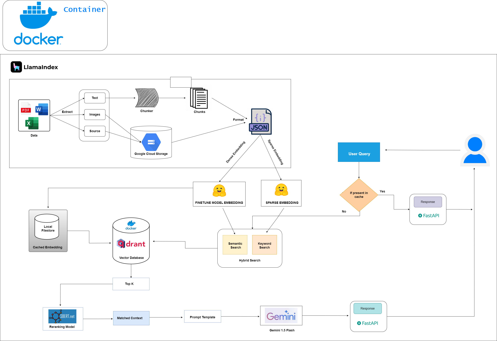
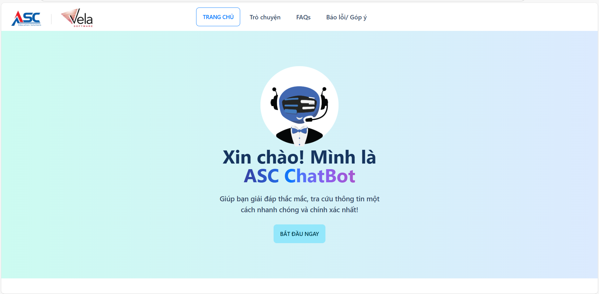
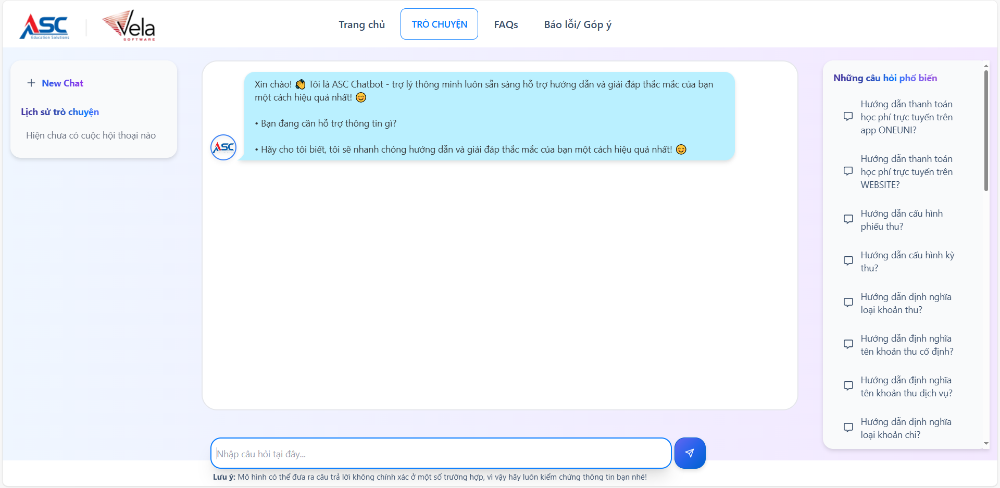
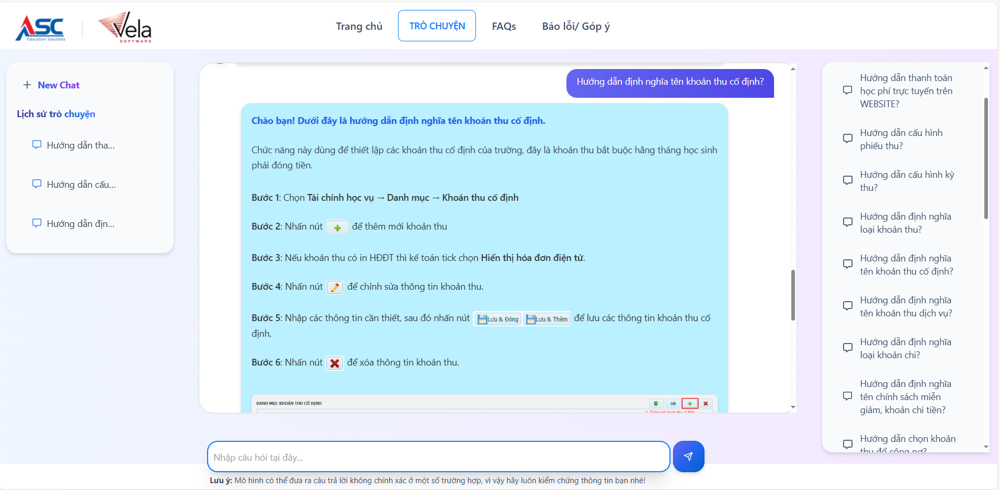
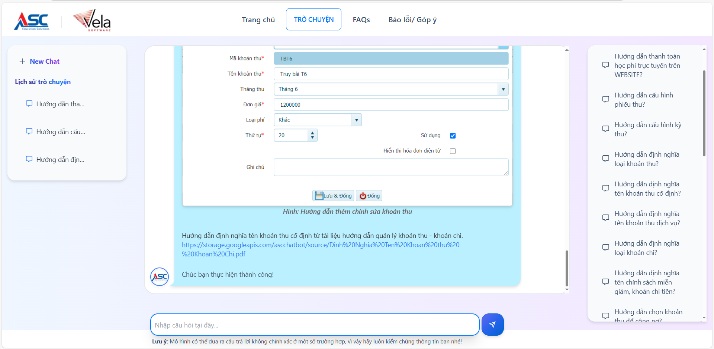

# ASC Chatbot - A customer support chatbot using LLM + Document Retriever (RAG) in Vietnamese

## 📝 Project Description
The **Customer Support Chatbot** is an automated customer support system built using **Retrieval-Augmented Generation (RAG)** architecture combined with **Gemini LLM** and **LlamaIndex**. This chatbot is designed to enhance customer support efficiency, reduce operational costs, and improve the accuracy of responses to customer queries.

## 🎯 Objectives
- **Reduce** support team size by **30%** through automated customer query handling.
- **Lower API costs** by **40%** using a combination of **semantic embeddings** and **keyword filtering**.
- Achieve **85% retrieval accuracy** and **95% uptime**, with response times under **5 second**.

## 🛠 Technologies Used
- **Programming Language**: Python
- **AI Models**: Gemini LLM, RAG Architecture, LlamaIndex
- **Natural Language Processing (NLP)**: Sentence-Transformers
- **Embedding Model**: ASC Embedding (Fine-tuned)
- **Sparese Model**: Qdrant/bm42-all-minilm-l6-v2-attentions ([HuggingFace](https://huggingface.co/Qdrant all_miniLM_L6_v2_with_attentions))
- **Rerank Model**: cross-encoder/ms-marco-MiniLM-L-6-v2 ([HuggingFace](https://huggingface.co/cross-encoder/ms-marco-MiniLM-L-6-v2))
- **Vector Database**: Qdrant
- **Backend**: FastAPI, Docker
- **Deployment**: RESTful APIs, Docker Container
- **Other Tools**: Git, Postman

## Workflow


## Demo
- Video Demo: https://storage.googleapis.com/ascchatbot/source/ASC.mp4
- Live front-end (no server): https://khavanw.github.io/Customer-Support-Chatbot/ 
- Homepage

- Chatbot




## 🚀 Key Features

- 🔹 **Multi-Source Data Support**  
  - The chatbot can process data from various formats, including **PDF, Word, and Excel**.  
  - Data is **chunked** and converted into **JSON format** for efficient processing.  

- 🔹 **Dual Embedding System**  
  - Uses **semantic embeddings** (fine-tuned model) and **sparse embeddings** (keyword matching) to enhance search accuracy.  
  - **Embedding Model**: [ASC_Embedding](https://huggingface.co/vankha/asc_embedding) is fine-tuned to match project-specific data.  

- 🔹 **Hybrid Search Mechanism**  
  - Combines **semantic search** and **keyword search** for optimized query results.  
  - Utilizes a **reranking model** to improve result accuracy.  

- 🔹 **Gemini LLM Integration**  
  - Leverages **Gemini 1.5** with custom **prompt templates** for generating natural and precise responses.  

- 🔹 **Easy Deployment**  
  - The application is **containerized using Docker** and deployed as **RESTful APIs** with **FastAPI**.  

## 📂 Project Structure

Customer-Support-Chatbot/
├── backend/               # Backend source code
│   ├── data/              # Directory containing input data (PDF, Word, Excel)
│   ├── models/            # Directory containing fine-tuned AI models
│   ├── src/               # Main source code
│   │   ├── data_processing/  
│   │   ├── embeddings/        
│   │   ├── search/           
│   │   ├── api/               
│   │   └── utils/             
│   ├── Dockerfile         
│   └── requirements.txt  
├── frontend/              # Frontend source code
│   ├── public/            
│   ├── src/              
│   │   ├── components/   
│   │   ├── pages/        
│   │   ├── App.js         
│   │   └── index.js       
│   ├── Dockerfile        
│   └── package.json      
├── docker-compose.yml     # Docker Compose configuration file to run both Frontend and Backend
└── README.md             

## 🛠 Installation & Running the Project  

### 1️⃣ Setup Environment  
Ensure you have **Python 3.8+**, **Node.js**, and **Docker** installed.  

Clone the repository (if you have access):  

```bash
git clone https://github.com/Khavanw/Customer-Support-Chatbot.git
cd Customer-Support-Chatbot
```

### 2️⃣ Install Backend Dependencies
Navigate to the backend directory and install required dependencies:
```bash
cd backend
pip install -r requirements.txt
```

Download the fine-tuned Embedding Model:
```bash
from transformers import AutoModel
model = AutoModel.from_pretrained("vankha/asc_embedding")
model.save_pretrained("models/asc_embedding")
```
### 3️⃣ Install Frontend Dependencies
Navigate to the frontend directory and install required packages:
```bash
cd ../frontend
npm install
```
### 4️⃣ Run the Project with Docker Compose
Run both the **Frontend** and **Backend** using Docker Compose:
```bash
docker-compose up --build
```
### 5️⃣ Access the Application
- **Frontend**: http://localhost:3000
- **Backend** API: http://localhost:8000

## 📞 Contact  
If you have any questions or contributions, feel free to reach out:  

- **Email**: [nguyenvankha0812@gmail.com](mailto:nguyenvankha0812@gmail.com)  
- **GitHub**: [Khavanw](https://github.com/Khavanw)  

## 📜 License  
This project is **private** and not publicly distributed.  
All source code and model details are owned by the author.  
